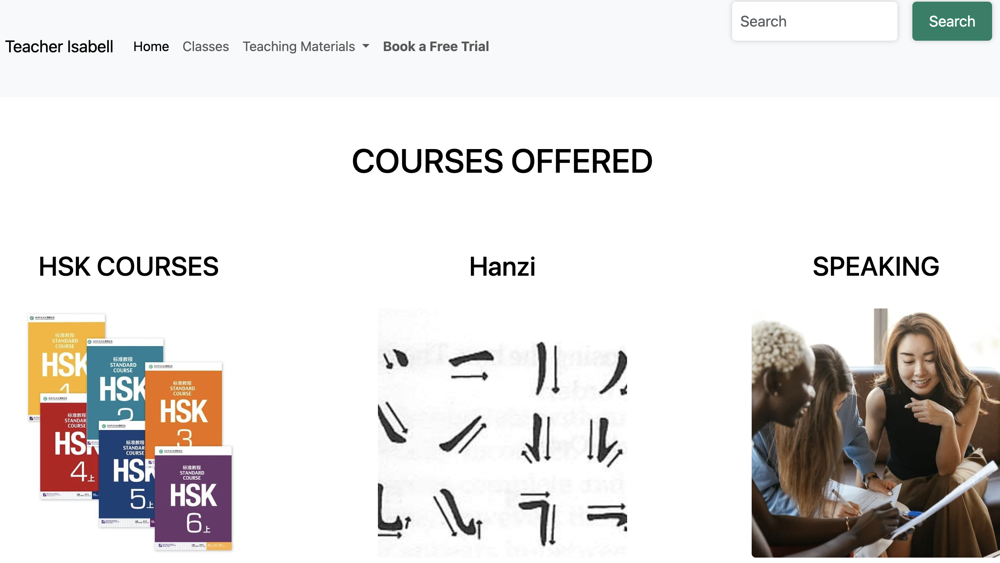

# Learn Chinese with Isabell

This project provides a website where you can find materials and book live classes for learning the Chinese language and culture with the guidance of a Chinese teacher, Isabell. Whether you're looking to improve your language skills, dive into Hanzi characters, or enhance your speaking ability, you'll find valuable resources and courses here.

## Features

- Live previews:https://main--learnchinesewithisabell.netlify.app/
  
- Cross platform

## Tech Stack

**Client:**
HTML 5 CSS VanillaJS

## Run Locally

Clone the project

```bash
  git clone https://github.com/117Isabell/learnchinesewithisabell.git
```

Go to the project directory

```bash
  cd learnchinesewithisabell
```

Start the project in VS code live server

```bash
  code .
```

## Improvements

If I had more time, I would enhance the project by building the backend using Node.js, EJS, and MongoDB. This would allow for:

Dynamic Content: Using EJS to render dynamic web pages.
Database Integration: Implementing MongoDB to store user data, course information, and other resources.
User Authentication: Adding login and registration functionalities.
Enhanced Interactivity: Creating a more interactive user experience with personalized content.
